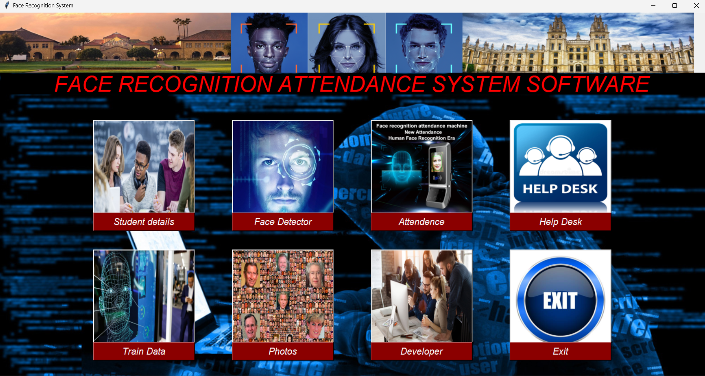

# 🎓 Face Recognition Based Attendance System

This project is a Python-based desktop application that automates attendance tracking using facial recognition. Designed with a user-friendly GUI, it captures student details, trains a facial recognition model, and accurately marks attendance in real-time.



---

## 📌 Features

- 🎯 **Student Management**: Add, update, delete student records with department, course, and photo samples.
- 👁️ **Face Detection & Recognition**: Real-time face detection using OpenCV and attendance marking based on facial recognition.
- 📸 **Data Training Module**: Trains the model on collected photo samples to recognize faces.
- 🗂️ **Attendance System**: Records and stores attendance with date and time.
- 🆘 **Help Desk**: Support section for user guidance.
- 👨‍💻 **Developer Info**: About the creators and contributors.

---

## 🧰 Tech Stack

- **Frontend**: Python `Tkinter` for GUI
- **Backend**: Python scripts and file-based data handling
- **Libraries Used**:
  - `OpenCV` – Face detection and recognition
  - `NumPy` – Data operations
  - `PIL` – Image processing
  - `Tkinter` – GUI interface
  - `csv` – For saving attendance data

---

## 🖼️ More Screenshots

### Student Management Panel


---

## 🚀 How to Run Locally

1. **Clone the Repository**

```bash
git clone https://github.com/Shiva6200744685/Face-Recognition-Based-Attendance-System-Project.git
cd Face-Recognition-Based-Attendance-System-Project
